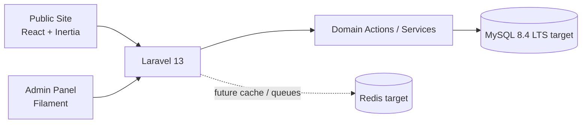

<p align="center">
  
</p>

<h1 align="center">Bubble Clean</h1>

<p align="center">
  <strong>Conversion-first marketing site now. Operational software platform next.</strong>
</p>

<p align="center">
  Bubble Clean starts as a polished one-page website for a real local cleaning business and is being structured to grow into an internal product for lead management, quoting, scheduling, and day-to-day operations.
</p>

<p align="center">
  
  
  
</p>

<p align="center">
  
  
  
  
  
  
  
  
</p>

## Product Snapshot

| Today | Next | Long-term Direction |
| --- | --- | --- |
| A branded one-page site focused on trust, service clarity, and lead capture. | Contact flows, structured leads, admin CRUDs, and quote handling. | A business operating system for quoting, scheduling, customer records, and internal workflows. |

## Why This Repository Matters

- It is not just a landing page. It is the first production-facing layer of a business platform.
- It shows product thinking, not only UI execution.
- It keeps the stack unified so the project can scale without splitting into disconnected apps too early.
- It is intentionally portfolio-friendly: real business context, clean code structure, and a clear technical roadmap.

## Architecture At A Glance



## Why This Stack

| Layer | Technology | Why it fits Bubble Clean |
| --- | --- | --- |
| Backend |  +  | Laravel gives the project strong conventions, fast delivery, excellent ecosystem support, and a clean path from MVP to a more serious commercial platform. |
| Public Frontend |  +  +  | React supports reusable UI composition, Inertia avoids a premature public API, and TypeScript keeps the front-end layer safer as the product grows. |
| UI Delivery |  +  | Vite keeps iteration fast. Tailwind is available for utility-driven screens, while branded landing sections can still use dedicated CSS tokens when design fidelity matters more than utility classes. |
| Admin |  | Filament gives the internal side of the product a fast start for CRUDs, dashboards, and workflow screens without building every admin pattern from scratch. |
| Auth & Quality |  +  +  | The project starts with a trustworthy authentication foundation and keeps room for testing and code style enforcement from the beginning. |

## Engineering Direction

This repository follows a **modern monolith** approach.

That means:

- one Laravel application
- one shared domain layer
- a React-powered public experience through Inertia
- a Filament-powered internal admin area
- fewer deployment and integration boundaries early on
- a cleaner upgrade path as the business logic becomes more complex

For a local-service platform, this is the right tradeoff: fast execution now, low operational overhead, and enough structure to support serious growth later.

## What Is Already Implemented

- Branded public one-page marketing site built with React + Inertia
- Reusable public layout and section components
- Bubble Clean brand tokens for color and surface styling
- Auto-rotating area coverage slider with local service imagery
- Structured content layer for public sections and CTAs
- Laravel Breeze authentication foundation
- Filament installed for the future internal admin experience

## Planned Product Modules

| Module | Purpose |
| --- | --- |
| Public Site | Marketing pages, service pages, FAQs, and conversion-focused entry points |
| Leads | Capture, qualification, status tracking, and follow-up workflow |
| Quote Engine | Service configuration, add-ons, pricing logic, and quote generation |
| Scheduling | Booking coordination and operational calendar management |
| Routing | Travel planning and local service logistics |
| Reports | Commercial and operational visibility for the business |
| Marketing / SEO | Editable content, metadata, and conversion tooling |

## Documentation Standard

- Repository documentation is written in English.
- Code comments are written in English.
- Comments should explain intent, tradeoffs, or business context, not obvious syntax.
- Internal working files inside `docs/` are treated as private source material and are not meant to ship with the public repository.

## Project Structure

```txt
app/
  Domain/
  Actions/
  Services/
  Http/
  Models/
  Filament/

resources/
  js/
    Components/
    Layouts/
    Pages/
      Public/
      Auth/
      Dashboard/
    data/
  css/

routes/
  web.php
  auth.php
```

## Local Setup

### 1. Install dependencies and bootstrap the app

```bash
composer run setup
```

### 2. Run the database migrations

```bash
php artisan migrate
```

### 3. Start the local development environment

```bash
composer run dev
```

## Useful Commands

```bash
# Production front-end build
npm run build

# Run the automated test suite
composer run test

# Check the framework version
php artisan --version
```

## What Recruiters And Tech Leads Should Notice

- The project is grounded in a real business use case instead of a generic showcase theme.
- The codebase is being organized for scale from the start, not retrofitted later.
- The chosen stack balances speed, maintainability, and long-term product evolution.
- The public site is already component-driven, content-structured, and design-tokenized.
- The repository tells a believable story: business problem, implementation choices, and a clear next phase.

## Roadmap

- [x] Establish Laravel + React + Inertia foundation
- [x] Install Filament for the admin direction
- [x] Build the first branded public landing page
- [x] Introduce reusable content and layout patterns for public pages
- [ ] Add structured lead capture and contact workflows
- [ ] Introduce quoting logic and admin-side lead management
- [ ] Add operations-oriented scheduling screens
- [ ] Expand the marketing layer with more public pages and SEO controls

## Summary

Bubble Clean is designed to be more than a polished local-service website.

It is the opening layer of a business platform with:

- a conversion-focused public experience
- a professional internal admin direction
- a stack selected for real operational growth
- a repository structure strong enough to support the next product phase
