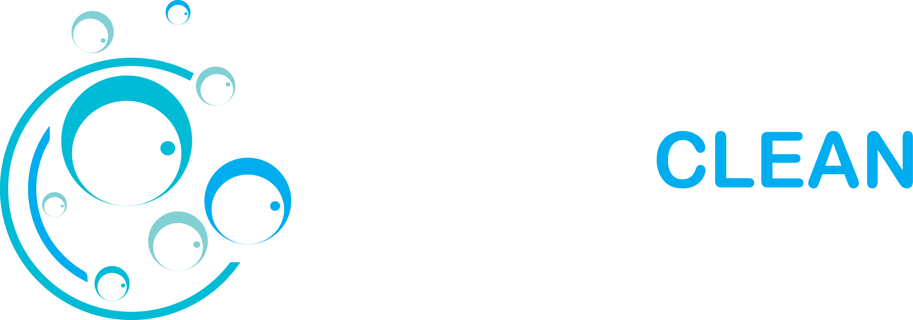
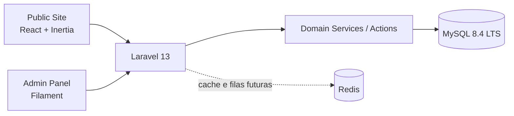

<p align="center">
  
</p>

<h1 align="center">Bubble Clean</h1>

<p align="center">
  <strong>Landing page institucional + base escalavel para um futuro sistema operacional comercial.</strong>
</p>

<p align="center">
  Este repositorio nasce como uma one-page de captacao para um negocio local de limpeza
  e evolui para uma plataforma interna de leads, orcamentos, agenda, rotas, indicadores e operacao.
</p>

<p align="center">
  
  
  
</p>

<p align="center">
  
  
  
  
  
  
  
  
</p>

## Visao Geral

| Hoje | Proximo passo | Direcao do produto |
| --- | --- | --- |
| Landing page one-page para apresentar a marca e captar interesse. | Leads, formularios, painel e CRUDs iniciais. | Sistema interno de orcamentos, agenda, operacao e gestao comercial. |

### O que este projeto quer provar

- Produto com pensamento de negocio, nao apenas uma interface bonita.
- Arquitetura preparada para crescer sem separar front e back cedo demais.
- Base profissional para portfolio, recrutadores e evolucao real de software.

## Por que este repositorio chama atencao

- Une **site publico**, **painel administrativo** e **camada de negocio** em uma unica aplicacao.
- Parte de um caso de uso real: servicos locais com captacao, qualificacao e operacao.
- Evita overengineering no MVP, mas ja deixa a estrutura pronta para modulos maiores.
- Mostra criterio de arquitetura, UX, componentizacao e visao de produto.

## Arquitetura Em 20 Segundos



### Decisao arquitetural

**Modern Monolith** foi a escolha central do projeto.

Isso significa:

- uma unica aplicacao Laravel
- front publico com React via Inertia
- painel interno com Filament
- regra de negocio centralizada no backend
- menos atrito operacional
- caminho de crescimento mais controlado

Em vez de separar SPA + API + painel em projetos distintos cedo demais, a ideia aqui e crescer com uma base unica, previsivel e mais facil de manter.

## Stack Atual No Repositorio

| Camada | Stack | Por que esta aqui |
| --- | --- | --- |
| Backend |   | Alta produtividade, excelente ecossistema, convencoes fortes e base madura para sistema comercial. |
| Frontend |      | React entrega componentizacao, Inertia elimina uma API publica prematura, TypeScript aumenta previsibilidade, Tailwind acelera UI e Vite mantem o ciclo de desenvolvimento rapido. |
| Painel interno |  | Admin moderno e rapido de evoluir, ideal para CRUDs iniciais e operacao interna. |
| Autenticacao |  | Base oficial, simples de manter e pronta para expandir com papeis e middleware administrativo. |
| Qualidade |   | Testes e padronizacao desde a fundacao, para o projeto crescer com menos entropia. |

## Stack Alvo De Producao

| Camada | Stack | Motivo |
| --- | --- | --- |
| Banco principal |  | Banco solido para produto de negocio, bom suporte e maturidade para relatorios, leads e operacao. |
| Cache e filas |  | Preparacao para filas, cache, automacoes e ganho de performance conforme o produto crescer. |

> Observacao importante:
> o bootstrap local atual pode usar SQLite para simplificar o inicio,
> mas a stack-alvo do produto e de producao foi definida com MySQL 8.4 LTS e Redis preparado para a proxima fase.

## Escopo Atual

- [x] Base em Laravel 13
- [x] Inertia.js com React
- [x] TypeScript no frontend
- [x] Tailwind CSS + Vite
- [x] Starter de autenticacao com React + Inertia
- [x] Filament instalado para o painel administrativo
- [x] One-page inicial inspirada em tema HTML adaptado para a stack do projeto
- [x] Estrutura publica preparada para novas paginas
- [ ] Captacao e gestao de leads
- [ ] Motor de orcamentos
- [ ] Agenda operacional
- [ ] Rotas e deslocamentos
- [ ] Relatorios e indicadores
- [ ] Marketing, SEO e conteudo administravel

## O Que Recrutadores E Tech Leads Devem Notar

- **Pensamento de produto:** nao e um tema isolado, e a primeira camada de um sistema comercial em evolucao.
- **Arquitetura intencional:** a stack foi escolhida para permitir crescimento real sem retrabalho estrutural.
- **Boa leitura tecnica:** React no front, Laravel no core, Filament no admin e caminho claro para dominio.
- **Execucao com criterio:** a landing atual ja respeita componentizacao, layout reutilizavel e separacao por contexto.
- **Espaco para maturidade:** o repo mostra fundacao, direcao e potencial de evolucao tecnica.

## Estrategia De Organizacao

O projeto comeca enxuto, mas a direcao de organizacao ja esta definida:

```txt
app/
  Domain/
  Actions/
  Services/
  Http/
  Models/
  Filament/

resources/
  js/
    Components/
    Layouts/
    Pages/
      Public/
      Auth/
      Dashboard/
  css/

routes/
  web.php
  auth.php
```

### Intencao por tras da estrutura

- `Pages/Public` concentra a experiencia publica do site.
- `Layouts` evita repetir estrutura e acelera novas paginas.
- `Domain`, `Actions` e `Services` sao a evolucao natural para regras de negocio mais fortes.
- `Filament` vira o centro da operacao administrativa.

## Modulos Planejados

| Modulo | Papel no produto |
| --- | --- |
| Public Site | Home, sobre, servicos, contato, privacidade, termos e solicitacao de orcamento |
| Leads | Captura, qualificacao, historico, atribuicao e status comercial |
| Quote Engine | Composicao de orcamentos por itens, regras, observacoes e valor final |
| Scheduling | Agenda operacional e organizacao das execucoes |
| Routing | Deslocamento, rota e apoio logistico |
| Reports | Indicadores comerciais e operacionais |
| Marketing / SEO | Conteudo, metadados e scripts de conversao |

## Quick Start

### 1. Instalar dependencias

```bash
composer run setup
```

### 2. Rodar migrations

```bash
php artisan migrate
```

### 3. Subir ambiente local

```bash
composer run dev
```

## Comandos Importantes

```bash
# rodar frontend em producao
npm run build

# rodar testes
php artisan test

# ver versao do framework
php artisan --version
```

## Estado Atual Da Base

| Area | Status |
| --- | --- |
| Landing page publica | Em andamento e pronta para evolucao |
| Painel admin | Base instalada com Filament |
| Auth | Starter kit pronto |
| Dominio de negocio | Estruturacao inicial |
| Infra de produto | Direcao definida para MySQL + Redis |

## Resumo Final

**Bubble Clean** nao foi pensado como um "site de servicos" qualquer.
Ele foi desenhado como o inicio de um produto operacional:

- bonito o suficiente para portfolio
- organizado o suficiente para time tecnico
- simples o suficiente para o MVP
- estruturado o suficiente para crescer

Se a primeira fase e uma landing page, a segunda ja aponta para um sistema comercial interno completo.
